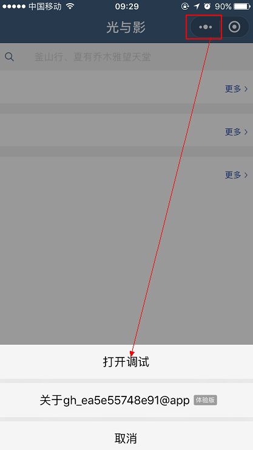

### 源码下载
```
$ git clone https://github.com/Jijmin/wxmini.git
```

### 屏幕截图
1. [欢迎页](./screenshot/欢迎页.PNG)
2. [Top250](./screenshot/Top250.PNG)
3. [播放音乐显示音乐背景图](./screenshot/播放音乐显示音乐背景图.PNG)
4. [电影列表](./screenshot/电影列表.PNG)
5. [电影搜索](./screenshot/电影搜索.PNG)
6. [电影详情页](./screenshot/电影详情页.PNG)
7. [电影详情页2](./screenshot/电影详情页2.PNG)
8. [费率结构](./screenshot/费率结构.PNG)
9. [分享](./screenshot/分享.PNG)
10. [分享页面](./screenshot/分享页面.png)
11. [海报全屏显示](./screenshot/海报全屏显示.PNG)
12. [基金经理](./screenshot/基金经理.PNG)
13. [基金列表](./screenshot/基金列表.PNG)
14. [基金首页](./screenshot/基金首页.PNG)
15. [基金详情canvas折线图](./screenshot/基金详情canvas折线图.PNG)
16. [即将上映](./screenshot/即将上映.PNG)
17. [文章取消收藏](./screenshot/文章取消收藏.PNG)
18. [文章收藏](./screenshot/文章收藏.PNG)
19. [文章详情页](./screenshot/文章详情页.PNG)
20. [阅读列表](./screenshot/阅读列表.PNG)
21. [阅读首页](./screenshot/阅读首页.PNG)
22. [正在热映](./screenshot/正在热映.PNG)
23. [资产配置](./screenshot/资产配置.PNG)

### 体验版
获取数据的接口是http的，需要开启调试模式才能获取到http的数据



### 小程序实现的功能
1. 设置全局的最上层导航栏的颜色基准
2. 新建一个测试页面，测试小程序框架的完整
3. 欢迎页面的搭建
4. 欢迎页面导航栏颜色单独进行配置
5. 欢迎页面跳转阅读页的路由设置
6. 阅读页面轮播图组件的搭建
7. 阅读页面文章做成模板的形式，在阅读页进行引入，提高代码的复用性
8. 模拟文章本地数据
9. 将假数据填充到页面
10. 配置阅读页面的title
11. 阅读页轮播图跳转对应详情页面的路由配置
12. 阅读页文章组件跳转对应的详情页的路由配置
13. 详情页结构样式编写
14. 将文章数据填充到详情页
15. 点击文章主图播放音乐，显示音乐封面图
16. 小程序中通过设置data中间量，将数据在两个函数中传递
17. 音乐后台运行，记录正在播放的音乐以及状态，作用域是整个小程序项目，需要使用全局变量
18. 音乐暂停控制
19. 将用户收藏文章状态实现本地存储
20. 弹窗提示
21. 打开多个post-detail页面之后,每个页面不会关闭,只会隐藏。通过页面栈拿到当前页面的postid,只处理当前页面的音乐播放
22. 分享样式，占时没有实现真正分享的功能
23. 电影页面搜索框结构以及样式
24. 评分组件
25. 单个电影组件
26. 电影组件列表
27. 电影列表+头部组件
28. 微信小程序需要事先设置一个通讯域名，小程序可以跟指定的域名与进行网络通信。包括普通 HTTPS 请求（request）、上传文件（uploadFile）、下载文件（downloadFile) 和 WebSocket 通信（connectSocket）
29. 只支持https，在小程序中配置相关选项
30. 电影列表页面数据填充，评分组件功能实现
31. 新闻列表页更多页面结构和样式
32. 更多页面数据填充，复用之前电影的组件
33. 实现瀑布流加载
34. 电影详情页数组填充
35. 搜索功能
36. 整个小程序体验
37. 发布为体验版
38. 配置体验白名单
40. 提交到github
41. 基金列表页结构和样式
42. 基金列表数据填充
43. 基金详情页结构和样式
44. canvas绘制基金单位净值折线图
45. 费率结构结构和样式
46. 资产配置结构和样式
47. 基金经理结构和配置